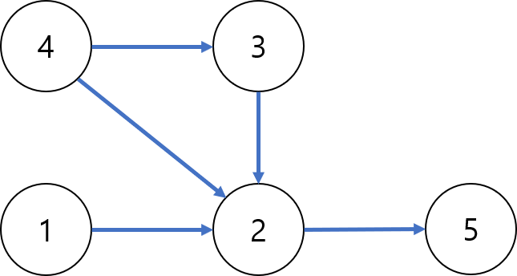
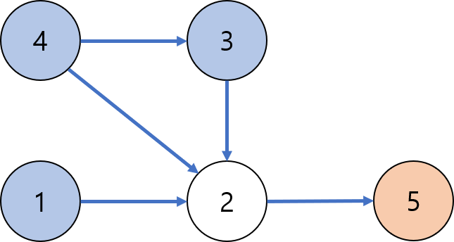
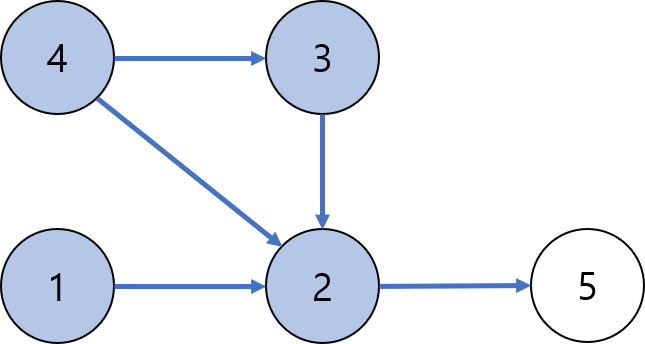

# 순위

출처: https://programmers.co.kr/learn/challenges

## 지문

n명의 권투선수가 권투 대회에 참여했고 각각 1번부터 n번까지 번호를 받았습니다. 권투 경기는 1대1 방식으로 진행이 되고, 만약 A 선수가 B 선수보다 실력이 좋다면 A 선수는 B 선수를 항상 이깁니다. 심판은 주어진 경기 결과를 가지고 선수들의 순위를 매기려 합니다. 하지만 몇몇 경기 결과를 분실하여 정확하게 순위를 매길 수 없습니다.

선수의 수 n, 경기 결과를 담은 2차원 배열 results가 매개변수로 주어질 때 정확하게 순위를 매길 수 있는 선수의 수를 return 하도록 solution 함수를 작성해주세요.

제한사항
선수의 수는 1명 이상 100명 이하입니다.
경기 결과는 1개 이상 4,500개 이하입니다.
results 배열 각 행 [A, B]는 A 선수가 B 선수를 이겼다는 의미입니다.
모든 경기 결과에는 모순이 없습니다.

입출력 예

n	| results	| return
--|---------|-------
5	| [[4, 3], [4, 2], [3, 2], [1, 2], [2, 5]]	| 2

입출력 예 설명
2번 선수는 [1, 3, 4] 선수에게 패배했고 5번 선수에게 승리했기 때문에 4위입니다.
5번 선수는 4위인 2번 선수에게 패배했기 때문에 5위입니다.

## 해설

한 선수가 정확하게 자신의 순위를 알기 위해서는, 두가지 정보를 알고 있어야 합니다.

1. 자신보다 강한 선수의 수
2. 자신보다 약한 선수의 수

위 숫자를 합해서 전체 선수의 명수인 n-1이 된다면 자신의 순위를 정확하게 파악할 수 있습니다.

예시)
- n = 6,
- 나보다 강한 선수 3명, 나보다 약한 선수 2명
- 약한 >> 2명 >> 나 >> 3명 >> 강한 이므로 나의 순위는 4위

문제 상에서 주어진 배열의 각 행에는 A가 B를 이겼다가 [A, B]와 같이 표현되어 있습니다. 이를 그래프로 치환하여 표현하면, A -> B와 같이 표현할 수 있습니다. 입출력 예를 이와 같이 그래프로 바꾸어서 표현할 경우 다음과 같습니다.

그래프 상에서 2보다 약한 선수는 2에서 출발하여 도달할 수 있는 모든 노드입니다. 반대로 그래프 상에서 2보다 강한 선수는 노드에서 출발하여 화살표를 따라 2에 도착할 수 있는 노드입니다.

하늘색 노드들의 경우 직접 또는 다른 노드를 거쳐서 2로 도달할 수 있으므로, 2를 이길 수 있는 선수들입니다. 주황색 노드의 경우 2에서 화살표를 따라 도달할 수 있는 노드이므로, 2가 이길 수 있는 선수들입니다.

결과적으로 2는 3명보다 약하고 1명보다 강하기 때문에, 순위가 4위임을 확정할 수 있습니다.

위와 동일한 논리로 5번 선수는 4명보다 약하기 때문에 순위가 5위임을 확정할 수 있습니다.

아래 풀이과정에서는 Floyd-Warshall 알고리즘을 변형하여 모든 모드부터 다른 노드까지의 '최단거리'가 아닌 '도달가능 여부'를 체크하도록 답안을 구성하였습니다.

알고리즘은 다음과 같이 작동합니다.

1. 2차원 행렬로 그래프를 표현
  - 예시) 2에서 3으로 가는 간선이 있을 경우, 그래프의 (2, 3) 위치를 true로 지정(true = 도달가능)
  - 처음 주어진 모든 간선에 대해서 이와 같이 true로 세팅
  - 나머지 칸에 대해서는 최초 false로 설정

2. 모든 i(출발점), j(도달점), k(경유점)에 대해서 i에서 k를 거쳐서 j로 도달이 가능한지 확인한다.
  - (i, j)가 최초에 false
  - (i, k)가 true, (k, j)가 true인 경우 i에서 k를 거쳐서 j로 도달이 가능하므로 (i, j)를 true로 업데이트

3. 더이상 그래프의 업데이트가 이루어지지 않는 시점까지 2번 작업을 반복

위 알고리즘을 완료한 이후에, (2, j)가 true인 j들의 개수를 세면 2에서 출발하여 도달 가능한 정점의 개수를 알 수 있습니다. 또한 (i, 2)가 true인 i의 개수들을 세면 i에서 출발하여 2에 도달이 가능한 정점의 개수를 알 수 있습니다.

모든 정점에 대해 위 개수를 체크하고, 두 개수의 합이 n-1인 경우 answer값일 1씩 증가시켜 줍니다.

## 팁

Floyd-Warshall 알고리즘은 O(n3) 시간복잡도를 가지기 때문에, n이 많아질 경우 피하는 것이 좋습니다. 이 문제의 경우 n(선수의 수)가 100이하로 제한되어있기 때문에, 최악의 경우에도 1003 = 1,000,000 번 정도의 상대적으로 적은 계산횟수가 필요하기 때문에 이 알고리즘을 사용할 수 있었습니다.

## Solution.java
~~~
class Solution {
    public int solution(int n, int[][] results) {
        boolean[][] graph = new boolean[n][n];
        for(int i = 0; i < results.length; i++) {
            graph[results[i][0]-1][results[i][1]-1] = true;
        }

        boolean changed = true;

        while(changed) {
            changed = false;
            for(int i = 0; i < n; i++) {
                for(int j = 0; j < n; j++) {
                    for(int k = 0; k < n; k++) {
                        if(!graph[i][j] && graph[i][k] && graph[k][j]) {
                                graph[i][j] = true;
                                changed = true;
                        }
                    }
                }
            }
        }

        int answer = n;

        for(int i = 0; i < n; i++) {
            for(int j = 0; j < n; j++) {
                if(i == j) continue;
                else {
                    if(graph[i][j] || graph[j][i]) continue;
                    else {
                        answer--;
                        break;
                    }
                }
            }
        }
        return answer;
    }
}
~~~
